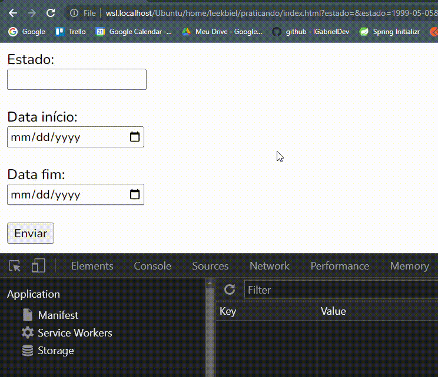

<!-- title -->
<h1 align="center">
    <span>LocalStorage</span>
    
</h1>


Recurso para criarmos variables no navegador do usuário. Assim, mesmo ao recarregar ou fechar a página os dados ainda continuam.

Esses dados ficam na aba `Application` do *inspect/inspecionar* do navegador.

Um bom exemplo para utilizar o localStorage, seria para aplicar o **Dark Mode** na sua página.


<br>


## Criando uma variable

Por padrão, criamos uma variable simples, onde temos **1 key e 1 value**. Esse value é uma String.

```js
//criamos 2 variables dentro do "localStorage"/navegador/pc do usuário
localStorage.setItem("naruto", "naruto zica memo"); //key and value
localStorage.setItem("sakura", "sakura bolada"); //key and value

//acessamos essas variables
const personagem1 = localStorage.getItem("naruto");
const personagem2 = localStorage.getItem("sakura");

//printamos no console
console.log(personagem1);
console.log(personagem2);
```

<hr>
<br>

## Criando uma variable Objeto
Podemos também criar uma variable mais complexa para armazenar no localStorage. Em outras palavras, conseguimos criar um objeto dentro do localStorage.


```js
//criamos um objeto
const personagem = {
    name: "naruto",
    age: 23,
    vila: "folha"
}

//Armazenamos no "localStorage" / navegador / computador do usuário.
localStorage.setItem("heroi", JSON.stringify(personagem));


//acessamos a variable no "localStorage"
const personagemInsano = localStorage.getItem("heroi");


//printamos no console
console.log(JSON.parse(personagemInsano));
```

💡 Perceba que para conseguirmos criar esse objeto lá dentro da localStorage, precisamos usar a class `JSON`. Como o localStorage só pode armazenar `String`, precisamos transformar o objeto em String, antes de armazená-lo.

- `JSON.stringify();` --> Transforma um objeto em String. 

- `JSON.parse();` --> Transforma uma String em objeto JSON.

<hr>
<br>

## Exercise 1

✏️ Crie o seguinte exercício:


;


Vamos usar uma variable criada no localStorage para manipular nossos elementos. Se a variable existir, fazemos isso. Se nao, fazemos isso.

<br>


- html

    ```html
    <body>
        <!-- div formulario -->
        <div id="containerFormulario">
            <h2>Login Bolado</h2>
            <form action="#" id="formulario">
                <label for="inputName">Name:</label>
                <input type="text" id="inputName" placeholder="Digite seu nome" name="name">
                <button id="enviarButton" type="submit">Enviar</button>
            </form>
        </div>

        <!-- div mensagem boas vindas -->
        <div id="boasVindasContainer">
            Bem vindo, <span id="boasVindasSpan">nome da pessoa</span>!
            <button id="sairButton">Sair</button>
        </div>
    </body>
    ```


<br>

- js

    ```js
    //elements we are going to use
    const input = document.querySelector("#nameInput");
    const submitButton = document.querySelector(".submitButton");
    const form = document.querySelector(".form");
    const title = document.querySelector(".title");
    const welcomeDiv = document.querySelector(".welcomeDiv");
    const welcomeMessage = document.querySelector(".welcomeMessage");
    const personNameSpan = document.querySelector(".personNameSpan");
    const backButton = document.querySelector(".backButton");


    //show the welcome div
    function showWelcomeDiv(personName){
        form.style.display = "none";
        title.style.display = "none";

        welcomeDiv.style.display = "block";
        personNameSpan.textContent = personName;
    }

    //back to form
    function backToForm(){
        welcomeDiv.style.display = "none";

        form.style.display = "block";
        title.style.display = "block";
    }


    //"submit" event
    submitButton.addEventListener("click", function(){
        localStorage.setItem("person", input.value);
        const personName = localStorage.getItem("person");
        showWelcomeDiv(personName);
    });

    //"back to form" event
    backButton.addEventListener("click", function(){
        localStorage.removeItem("person");
        backToForm();
    });


    //Even if we refresh the page, we will still in the same page
    if(localStorage.getItem("person") != null){
        showWelcomeDiv(localStorage.getItem("person"));
    }
    ```

⚠️ Sempre que for manipular (adicionar/remover) uma variable do localStorage, SEMPRE faça essas modificacoes DENTRO DO EVENTO.
<hr>
<br>

## Exercise 2

✏️ Faça o seguinte exercício:



Mesmo recarregando a página, os valores dos inputs continuam. Para fazer isso, basta armazenar os valores inputados dentro do localStorage.


- js
    ```js
    //selecionando os elementos
    const estado = document.querySelector("#estadoInput");
    const dataInicio = document.querySelector("#inicioInput");
    const dataFim = document.querySelector("#fimInput");
    const button = document.querySelector("#button");


    //function para salvar as informacoes inputadas no localStorage/computador/navegador do usuario
    function salvarInformacoes(){
        localStorage.setItem("estado", estado.value); //pegamos o valor do input
        localStorage.setItem("inicio", dataInicio.value);
        localStorage.setItem("fim", dataFim.value);
    }


    //criando um "click" event para o button
    button.addEventListener("click", function(e){
        salvarInformacoes();
    });


    //pegando o valor da variable do localStorage e colocando dentro do input

    //selecionamos as variables do localStorage
    const estadoLocalStorage = localStorage.getItem("estado");
    const dataInicioLocalStorage = localStorage.getItem("inicio");
    const DataFimLocalStorage = localStorage.getItem("fim");

    estado.value = estadoLocalStorage;
    dataInicio.value = dataInicioLocalStorage;
    dataFim.value = DataFimLocalStorage;
    ```