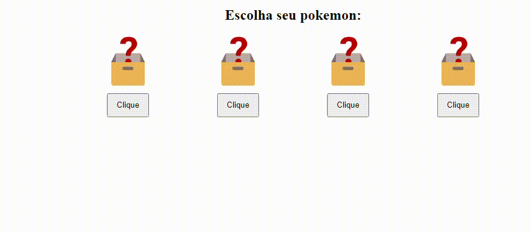

<h1 align="center">
    Criando/alterando um attribute
</h1>
 
Imagina que você quer alterar a **class** de um element, o **src** de uma image, o  **alt** de uma image, o **id** de um element, etc...

Para alterar um attribute, vamos usar o `setAttribute();`


```html
<body>
    <div class="containerZica">
        <h2>Salve</h2>
    </div>
</body>
```
✏️ 
- Crie um attribute "class" para o elemento
- Crie um attribute "id" para o elemento

```js
//selecionamos o elemento "h2"
const h2 = document.querySelector("h2");

//vamos adicionar o attribute "class" ao elemento
h2.setAttribute("class", "classBolada1 classBolada1"); // 1ºPasssamos o attribute que vamos setar, 2º Passamos o valor desse attribute.

//vamos adicionar o attribute "id" ao elemento
h2.setAttribute("id", "title");
```

<hr>
<br>

## Praticando

✏️ Altere o **src**  e o **width** de uma imagem.

Por exemplo, se o usuario clicar em um botao, a imagem será alterada, sacou??

```html
<body>
    
</body>
```


```js
//selecionamos o elemento "img"
const image = document.querySelector("#imagemBolada");

//alteramos o attribute "src"
image.setAttribute("src", "https://img.icons8.com/?size=512&id=VcTCb_viZ8ui&format=png");

//alteramos o attribute "width"
image.setAttribute("width", "200px");
```

😗 Imagine as possibilidades!

<br>
<br>
<br>

✏️ Faça o mesmo script, mas agora utilizando seu conhecimento em functions. Quando o usuario clicar no button, uma das images terá o "width" and "src" alterados. Quando chamarmos a function, vamos passar o id da image que queremos alterar.


```html
<body>
    <!-- imagem 1 -->
    

    <!-- imagem 2 -->
    

    <!-- Button para mudar o "src" e o width da imagem -->
    <button class="button" onclick="alterarImagem('image2')">Clique aqui</button>

    <!-- external script -->
    <script src="js/teste.js"></script>
</body>
```


```js

// function para mudar o "src" e o "width" de uma image
function alterarImagem(id){
    //selecionamos o elemento "img"
    const image = document.querySelector("#" + id);

    //alteramos o attribute "src"
    image.setAttribute("src", "https://img.icons8.com/?size=512&id=VcTCb_viZ8ui&format=png");

    //alteramos o attribute "width"
    image.setAttribute("width", "200px");
}
```

⚠️ Lembrando que nós só podemos setar os attributes. Para acessar o attribute **style** ou **alterar o CSS com javascript**, fazemos de outra forma.

<br>
<br>
<br>


✏️ Deixando mais complexo:

Faça o seguinte exercício:



<br>

```html
<body>
    <div class="porraToda">
        <h2>Escolha seu pokemon:</h2>

        <div class="images">
            <!-- image 1 -->
            <div class="image_container box_image1">
                
                <button class="button" onclick='changeImage("eagle")'>Clique</button>
            </div>
    
            <!-- image 2 -->
            <div class="image_container box_image2">
                
                <button class="button" onclick="changeImage('fox')">Clique</button>
            </div>
    
            <!-- image 3 -->
            <div class="image_container box_image3">
                
                <button class="button" onclick="changeImage('bear')">Clique</button>
            </div>
    
            <!-- image 4 -->
            <div class="image_container box_image4">
                
                <button class="button" onclick="changeImage('lion')">Clique</button>
            </div>
        </div>

        <div class="informacoesDoPokemon">
            <ul class="ulInformacoesPokemon">
                <li class="informacao_1">Salve</li>
                <li class="informacao_2">Salve</li>
            </ul>
        </div>

    </div>
    
    <!-- external script -->
    <script src="js/teste.js"></script>
</body>
```


```js
//criando objetos "pokemons"
const pokemonEagle = {
    name : "eagle",
    informacao1 : "Consegue voar",
    informacao2 : "Veloz e sagaz",
};


const pokemonFox = {
    name : "fox",
    informacao1 : "Anda na floresta",
    informacao2 : "Esperta e ligeira"
}


const pokemonBear = {
    name : "bear",
    informacao1 : "Grande e forte",
    informacao2 : "Destrutivo"
}


const pokemonLion = {
    name : "lion",
    informacao1 : "Rei da selva",
    informacao2 : "Rugido feroz"
}


//function para exibir as informacoes do pokemon

function mostrarInformacoesPokemon(pokemon){
    //selecionamos a div contendo as informacoes do pokemon
    const ul = document.querySelector("div.informacoesDoPokemon");


    //selecionamos cada "li"
    const informacao1 = document.querySelector("li.informacao_1");
    const informacao2 = document.querySelector("li.informacao_2");
    
    //alterando o conteudo de cada "li".
    informacao1.textContent = pokemon.informacao1;
    informacao2.textContent = pokemon.informacao2;


    //mostramos a div que estava com display "none"
    ul.style.display = "block"; 
    
}


//function para alterar as imagens
function changeImage(idDaImagem){
    
    //selecionamos o elemento que vamos alterar
    const image = document.querySelector("img#" + idDaImagem); // O elemento "img" que vamos selecionar vai depender do id que o usuario passar, quando chamar o method.


    //selecionamos cada imagem. Se o usuário escolher "lion", vamos alterar para a fotinha do lion e setar todas as outras images para a fotinha "random". Sacou??
    const imageEagle = document.querySelector("#eagle");
    const imageFox = document.querySelector("#fox");
    const imageBear = document.querySelector("#bear");
    const imageLion = document.querySelector("#lion");


    //alteramos a fotinha da "eagle", e todas as outras alteramos para a fotinha "random"
    if(idDaImagem === "eagle"){
        image.setAttribute("src", "https://img.icons8.com/?size=512&id=8-u0Qq1jv9mX&format=png");

        imageFox.setAttribute("src",  "https://img.icons8.com/?size=512&id=1YKSEjIedMKa&format=png");
        imageBear.setAttribute("src", "https://img.icons8.com/?size=512&id=1YKSEjIedMKa&format=png");
        imageLion.setAttribute("src", "https://img.icons8.com/?size=512&id=1YKSEjIedMKa&format=png");

        //chamamos a function para mostrar as informacoes do pokemon
        mostrarInformacoesPokemon(pokemonEagle);

    }
    //alteramos a fotinha da "fox", e todas as outras alteramos para a fotinha "random"
    else if(idDaImagem === "fox"){
        image.setAttribute("src", "https://img.icons8.com/?size=512&id=40811&format=png");

        imageBear.setAttribute("src",  "https://img.icons8.com/?size=512&id=1YKSEjIedMKa&format=png");
        imageLion.setAttribute("src", "https://img.icons8.com/?size=512&id=1YKSEjIedMKa&format=png");
        imageEagle.setAttribute("src", "https://img.icons8.com/?size=512&id=1YKSEjIedMKa&format=png");

        //chamamos a function para mostrar as informacoes do pokemon
        mostrarInformacoesPokemon(pokemonFox);

    }
    //alteramos a fotinha da "bear", e todas as outras alteramos para a fotinha "random"
    else if(idDaImagem === "bear"){
        image.setAttribute("src", "https://img.icons8.com/?size=512&id=yPTcBK5dVgwT&format=png");
        
        imageFox.setAttribute("src",  "https://img.icons8.com/?size=512&id=1YKSEjIedMKa&format=png");
        imageEagle.setAttribute("src", "https://img.icons8.com/?size=512&id=1YKSEjIedMKa&format=png");
        imageLion.setAttribute("src", "https://img.icons8.com/?size=512&id=1YKSEjIedMKa&format=png");

        //chamamos a function para mostrar as informacoes do pokemon
        mostrarInformacoesPokemon(pokemonBear);
    }
    //alteramos a fotinha da "lion", e todas as outras alteramos para a fotinha "random"
    else if(idDaImagem === "lion"){
        image.setAttribute("src", "https://img.icons8.com/?size=512&id=120346&format=png");

        imageFox.setAttribute("src",  "https://img.icons8.com/?size=512&id=1YKSEjIedMKa&format=png");
        imageBear.setAttribute("src", "https://img.icons8.com/?size=512&id=1YKSEjIedMKa&format=png");
        imageEagle.setAttribute("src", "https://img.icons8.com/?size=512&id=1YKSEjIedMKa&format=png");

        //chamamos a function para mostrar as informacoes do pokemon
        mostrarInformacoesPokemon(pokemonLion);
    }
}
```


<br>
<br>

<!-- next page button -->

[](../8.dom/4.alterando_css.md)