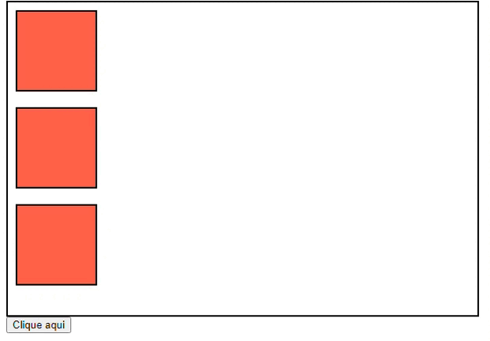

<h1 align="center">
    Alterando CSS com JavaScript
</h1>


```js
//selecionando um elemento
let h2 = document.querySelector("#title");

h2.style.color = "purple";
h2.style.backgroundColor = "tomato";
h2.style.fontSize = "52px";
h2.style.display = "none"; // removemos o elemento

//usamos camelCase
```

Quando a propriedade do css tiver mais de uma palavra, vamos substituir o `-` por camelCase.

*CSS padrao*
```css
h2{
    background-color: tomato;
}
```


*Alterando com JS*
```js
h2.style.backgroundColor = "red";
```


💡 Nós podemos setar a porra toda. Se quiser esconder um elemento, basta usar o `display:none;`. Você consegue alterar qualquer estilo do CSS.

<br>
<br>

## Praticando
✏️ Faça o exercício abaixo:


Ao clicar no button, a div pai vai ter o flex-direction alterado para row.




```html
<body>
    <div class="container">
        <div class="box"></div>
        <div class="box"></div>
        <div class="box"></div>
    </div>
    
    <button class="button" onclick="girarBoxes()">Clique aqui</button>
</body>
```

```js
//function para girar as boxes
function girarBoxes(){
    //selecionamos o container pai
    const divPai = document.querySelector(".container");

    //alteramos algumas propriedades css desse elemento
    divPai.style.flexDirection = "row";
    divPai.style.justifyContent = "space-between";
}
```

<br>
<br>

<!-- next page button -->

[](../8.dom/5.events.md)