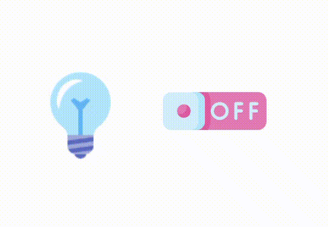
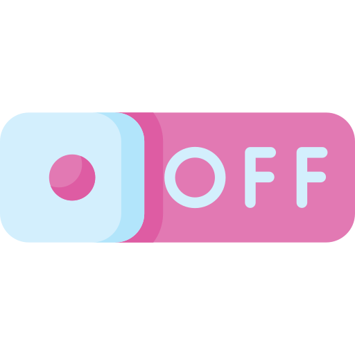

<!-- title -->
<h1 align="center">
    <span>Clonar um elemento</span>
</h1>

Para clonar um elemento que já existe, basta usarmos o `cloneNode()`;

- `true` --> Clona a porra toda, inclusive os filhos
- `false` --> Clona apenas o elemento

💡Nas duas formas (true/false) o elemento clona tudo(classes, id , etc...).

<hr>
<br>

## Praticando

```html
<body>
    <div class="container">
        <p>Salve 1</p>
        <p>Salve 1</p>
        <p>Salve 1</p>
    </div>
    <!-- JS external -->
    <script class="script" src="./js/script.js"></script>
</body>
```

<br>

✏️ Clone o elemento "div", inclusive com seus filhos.

```js
//selecionando o elemento que queremos clonar
const div = document.querySelector("div.container");
const novaDiv = div.cloneNode(true);
novaDiv.classList.add("salve");


//colocando esse novo elemento clonado dentro do body
const body = document.querySelector("body");
body.appendChild(novaDiv);
```

Perceba que o elemento clonado e seus filhos, são clonados por completo. Toda a formatação CSS que tiver nas classes que eles possuem, é clonado também.

<br>
<br>

✏️ Clone apenas o elemento "div", sem os filhos.

```js
//selecionando o elemento que queremos clonar
const div = document.querySelector("div.container");
const novaDiv = div.cloneNode(false);
novaDiv.classList.add("salve");


//colocando esse novo elemento clonado dentro do body
const body = document.querySelector("body");
body.appendChild(novaDiv);
```

<hr>
<br>

## classList
O classList são todas as informacoes de classe que um elemento têm. Podemos adicionar, remover, verificar se existe alguma class, etc...

Os principais methods são:

- `constains()` --> Verifica se existe "tal" class
- `add()` --> Adiciona uma class
- `remove()` --> Remove uma class
- `toggle()` --> Alternar. Se a class "tal" existir, ela é removida. Se a class "tal" não existir, ele é adicionada.

<br>

```html
<div class="container">Quadrado</div>
<button id="button">Colocar CSS</button>
```

<br>
<br>

### Adicionando uma class a um elemento

- Cria uma estilização para uma class no css. O elemento que receber essa class, sofrerá a alteração.

```css
.quadrado{
    width: 100px;
    height: 100px;
    background-color: tomato;
}

/* O elemento que receber essa class vai sofrer alteracao */
```

<br>

- Crie um evento de click para o "button" 

```js
//function para colorir de verde
function pintarVerde(element){
    element.classList.add("colorirFundoVerde");
    element.classList.remove("colorirFundoTomato");
}


//function para colorir de tomato
function pintarTomato(element){
    element.classList.add("colorirFundoTomato")
    element.classList.remove("colorirFundoVerde")
}


//criando evento "click" no button. Vai ficar alternando as cores do elemento
const button = document.querySelector("button#button");
button.addEventListener("click", function(){
    //selecionamos o elemento que vamos alterar
    const div = button.parentNode.querySelector("div.quadrado");

    if(div.classList.contains("colorirFundoTomato")){
        pintarVerde(div);
    }
    else{
        pintarTomato(div);
    }
});
```

Se ligou?? Podemos adicionar/remover/etc.. uma class, através do `classList()`;

<br>

### Adicionando e removendo uma class

Vamos criar o seguinte exercício:


Vamos seguir a lógica:

- Se o quadrado tiver a class "verde", vamos removê-la e adicionar a class "tomato".
- Se o quadrado tiver a class "tomato", vamos removê-la e adicionar a class "verde".

<br>

HTML

```html
<div class="quadrado colorirFundoTomato">Quadrado</div> <!-- Por padrao, ele terá a cor "tomato" -->
<button id="button">Colocar CSS</button>
```

<br>

CSS

```css
div{
    width: 100px;
    height: 100px;
    border: 2px solid black;
}


/* cor de fundo verde */
.colorirFundoVerde{
    background-color: rgb(66, 156, 66);
}


/* cor de fundo tomato */
.colorirFundoTomato{
    background-color: tomato;
}
```

<br>

JS

```js
//function para colorir de verde
function pintarVerde(element){
    element.classList.add("colorirFundoVerde");
    element.classList.remove("colorirFundoTomato");
}


//function para colorir de tomato
function pintarTomato(element){
    element.classList.add("colorirFundoTomato")
    element.classList.remove("colorirFundoVerde")
}

//criando evento "click" no button. Vai ficar alternando as cores do elemento
const button = document.querySelector("button#button");
button.addEventListener("click", function(){
    //selecionamos o elemento que vamos alterar
    const div = button.parentNode.querySelector("div.quadrado");

    if(div.classList.contains("colorirFundoTomato")){
        pintarVerde(div);
    }
    else{
        pintarTomato(div);
    }
});
```

<br>

Faça a mesma coisa, mas agora usando o `toggle()`;

```js
//function alterar as cores / alterar as classes
function trocarCor(element){
    element.classList.toggle("colorirFundoTomato"); //remove ou adiciona a class "tomato"
    element.classList.toggle("colorirFundoVerde"); //remove ou adiciona a class "verde"
}

//criando evento "click" no button. Vai ficar alternando as cores do elemento
const button = document.querySelector("button#button");
button.addEventListener("click", function(){
    //selecionamos o elemento que vamos alterar
    const div = button.parentNode.querySelector("div.quadrado");
    
    trocarCor(div);
});
```

💡 toggle(); é mais nice!

<hr>
<br>

### Faça o seguinte exercício:



<br>

- html

    ```html
    <div class="container">
        <!-- bulb image -->
        
        <!-- toggle button image -->
        
    </div>
    ```

<br>

- css

    ```css
    /* -------------------- configs iniciais -------------------- */
        *{
            margin: 0;
            padding: 0;
        }

        body{
            width: 100vw;
            height: 100vh;
            display: flex;
            justify-content: center;
            align-items: center;
        }


        /* -------------------- div pai -------------------- */
        div.container{
            width: 700px;
            height: 700px;
            border: 2px solid black;
            display: flex;
            justify-content: center;
            align-items: center;
        }


        /* ---------- images ---------- */
        img{
            width: 170px;
            height: 170px;
        }

        /* ----- bulb ----- */
        img#bulb{
            margin-right: 50px;
        }

        /* ----- button ----- */
        img#button{
            cursor: pointer;
        }
    ```

<br>

- js

    ```js
    //bulb
    const bulbOffSrc = "https://freesvg.org/img/afaulconbridge-Lightbulb-OnOff-2.png";
    const bulbOnSrc = "https://freesvg.org/img/afaulconbridge-Lightbulb-OnOff-1.png";

    //ligth switch
    const ligthSwitchOffSrc = "https://freesvg.org/img/cyberscooty-switch-off.png";
    const ligthSwitchOnSrc = "https://freesvg.org/img/cyberscooty-switch-on.png";

    const bulbImage = document.querySelector(".bulb");
    const switchImage = document.querySelector(".lightSwitch");


    //methods to on and off the lights
    function lightsOn(){
        bulbImage.setAttribute("src", bulbOnSrc)
        switchImage.setAttribute("src", ligthSwitchOnSrc)
        switchImage.classList.toggle("lightIsOn");
        switchImage.classList.toggle("lightIsOff");

        localStorage.setItem("bulbIsOn", true);
    }

    function lightsOff(){
        bulbImage.setAttribute("src", bulbOffSrc)
        switchImage.setAttribute("src", ligthSwitchOffSrc)
        switchImage.classList.toggle("lightIsOff");
        switchImage.classList.toggle("lightIsOn");

        localStorage.setItem("bulbIsOn", false);
    }


    //"click" event
    const button = document.querySelector(".lightSwitch");

    button.addEventListener("click", function(){
        if(switchImage.classList.contains("lightIsOff")){
            lightsOn();
        }
        else{
            lightsOff();
        }
    });

    //localStorage refresh page - Even if you refresh the browser, your light will still ON or OFF
    if(localStorage.getItem("bulbIsOn") == "true"){
        lightsOn();
    }
    else{
        lightsOff();
    }
    ```

⚠️ Importante lembrar que as variables criadas lá no **localstorage** tem os valores como String. Quando você for comparar os valores de lá, utilize String.

<br>

Uma outra forma de trabalhar com o localstorage, seria criando e removendo um variable de la. Assim, voce verifica se **tal item do localstorage é null ou não.**

```js
//localStorage refresh page - Even if you refresh the browser, your light will still ON or OFF
if(localStorage.getItem("bulbIsOn") != null){
    lightsOn();
}
else{
    lightsOff();
}
```
<br>
<br>

<!-- next page button -->

[](../9.dark_mode/dark_mode.md)