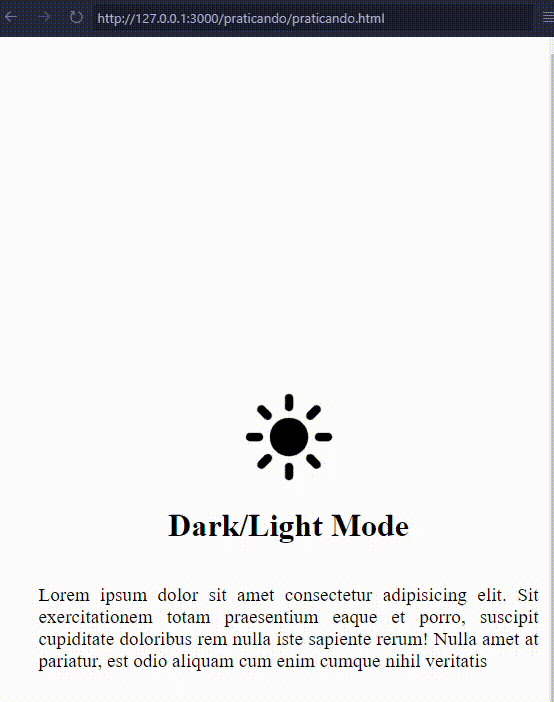

<!-- title -->
<h1 align="center">
    <span>Dark mode</span>
</h1>

Crie o exercício Abaixo:



<br>

- html
    ```html
    <body>
        <div class="container">
            <!-- Dark Mode button -->
            <ion-icon class="sunIcon" name="sunny"></ion-icon>
            <!-- title -->
            <h1 class="title">Dark/Light Mode</h1>
            <!-- conteudo -->
            <p class="text">Lorem ipsum dolor sit amet consectetur adipisicing elit. Sit exercitationem totam praesentium eaque et porro, suscipit cupiditate doloribus rem nulla iste sapiente rerum! Nulla amet at pariatur, est odio aliquam cum enim cumque nihil veritatis</p>
        </div>
        
        <!-- JS external -->
        <script src="./js/script.js"></script>

        <!-- ion icons -->
        <script type="module" src="https://unpkg.com/ionicons@7.1.0/dist/ionicons/ionicons.esm.js"></script>
        <script nomodule src="https://unpkg.com/ionicons@7.1.0/dist/ionicons/ionicons.js"></script>
    </body>
    ```

<br>

- css
    ```css
    /* css colors variables */
    :root{
        --corFundo:white;
        --corTexto:black;
    }

    /* configs padraozin */
    body{
        width: 100vw;
        height: 100vh;
        display: flex;
        flex-direction: row;
        justify-content: center;
        align-items: center;
        background-color: var(--corFundo); /* vamos mudar essas cores */
        color: var(--corTexto); /* vamos mudar essas cores */
    }

    .container{
        width: 500px;
        height: 500px;
        display: flex;
        flex-direction: column;
        justify-content: center;
        align-items: center;
    }

    .sunIcon{
        font-size: 6rem;
    }

    .title{
        font-size: 2rem;
    }

    .text{
        font-size: 1.2em;
        text-align: justify;
    }

    /* seletor para modificar a cor das variables */
    .darkMode{
        --corFundo:black;
        --corTexto:white;
    }
    ```
    
    <br>

- js

    ```js
    //images
    const bulbOnSrc = "https://www.svgrepo.com/show/452171/bulb.svg";
    const bulbOffSrc = "https://www.svgrepo.com/show/179323/light-bulb-technology.svg";

    //body
    const body = document.querySelector("body");


    //method to add/remove the darkmode class on body
    function onAndOffDarkMode(){
        body.classList.toggle("darkMode");
    }


    //method the "bulb" images
    function changeImages(){
        const bulb = document.querySelector("img.bulb");
        
        if(body.classList.contains("darkMode")){
            bulb.setAttribute("src", bulbOnSrc);
        }
        else{
            bulb.setAttribute("src", bulbOffSrc);
        }
    }


    const bulb = document.querySelector(".bulb");

    // "click" event
    bulb.addEventListener("click", function(){
        onAndOffDarkMode();
        changeImages();

        if(localStorage.getItem("darkIsOn") == null){
            localStorage.setItem("darkIsOn", "dark mode is on");
        }
        else{
            localStorage.removeItem("darkIsOn");
        }
    });


    // se a variable existir no localstorage, aplicamos o dark denovo
    if(localStorage.getItem("darkIsOn") != null){
        onAndOffDarkMode();
        changeImages();
    }
    ```

<br>
<br>

<!-- next page button -->
[](../10.local_storage/local_storage.md)